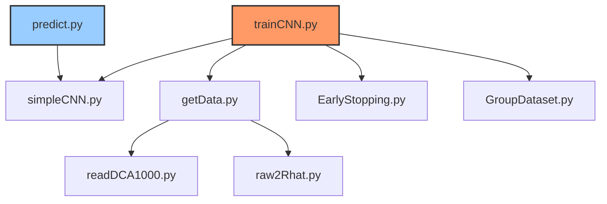
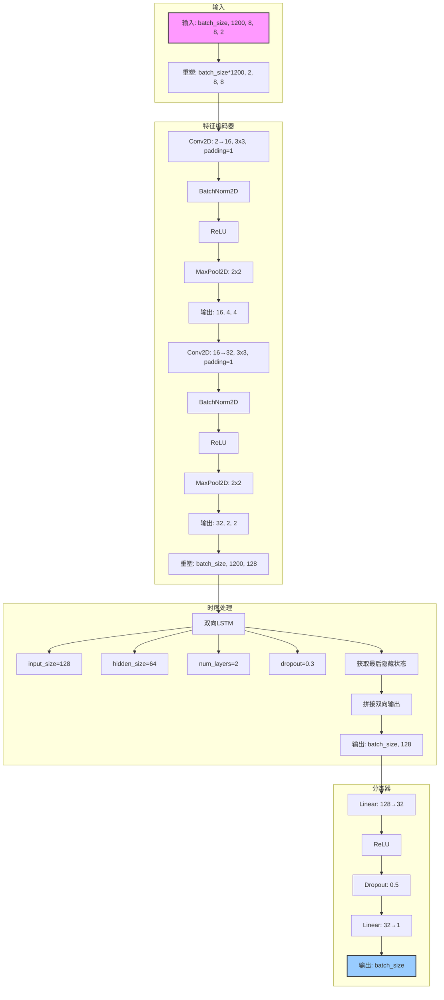

# 项目结构分析

## 调用关系

以下图表展示了 mmwave_project 中文件间的调用关系，以 trainCNN.py 作为主函数：

## 文件描述

### 主文件

- **trainCNN.py**: 协调CNN模型训练流程的主函数。通过导入多个模块实现数据加载、模型定义和包含早停机制的训练过程。

- **predict.py**: 使用训练好的模型进行预测的独立入口点。此文件不被trainCNN.py调用，但作为推理功能的另一个主函数。

### 支持模块

- **simpleCNN.py**: 定义用于调频信号回归的CNN模型架构，包含`ChirpRegressionModel`类。

- **getData.py**: 处理数据加载和预处理，包含从二进制文件加载雷达数据和从Excel加载验证数据的函数。

- **EarlyStopping.py**: 实现早停机制以防止训练过拟合。

- **GroupDataset.py**: 定义组织雷达数据和标签的PyTorch Dataset类。

- **readDCA1000.py**: 提供从DCA1000二进制文件读取和组织原始ADC数据的功能。

- **raw2Rhat.py**: 通过2D-FFT、背景消除、CFAR检测和ROI提取处理原始雷达数据，生成最终特征表示。

## 未使用文件

以下文件存在于项目中但未被主训练或预测函数直接调用：

- **deprecated/2dFFTtest.py**
- **deprecated/compute_background_and_subtraction.py**
- **deprecated/test.py**
- **deprecated/toR_hat.py**

这些文件似乎是已弃用版本或实验性代码，不再用于主流程。

## 数据流

1. **数据加载**: trainCNN.py调用getData.py加载和预处理雷达数据
2. **数据处理**: getData.py使用readDCA1000.py读取二进制文件，并通过raw2Rhat.py处理原始数据
3. **数据集创建**: 使用GroupDataset将处理后的数据组织成PyTorch Dataset
4. **模型定义**: CNN模型在simpleCNN.py中定义
5. **训练**: 使用EarlyStopping.py实现的早停机制训练模型
6. **预测**: 训练完成后，predict.py可使用训练好的模型进行预测

## 神经网络结构

以下是 ChirpRegressionModel 的网络结构图，展示了数据如何通过模型的各个组件进行处理：

### 模型处理流程

1. **输入处理**:
   - 输入形状: (batch_size, 1200, 8, 8, 2)，其中1200是时间步数，8x8是空间维度，2是实部和虚部
   - 重塑为(batch_size*1200, 2, 8, 8)以适应2D卷积操作

2. **特征提取**:
   - 第一卷积层: 2→16通道，3x3卷积核，输出(batch_size*1200, 16, 4, 4)
   - 第二卷积层: 16→32通道，3x3卷积核，输出(batch_size*1200, 32, 2, 2)
   - 重塑为(batch_size, 1200, 128)以准备时序处理

3. **时序处理**:
   - 双向LSTM处理1200个时间步，每步包含128个特征
   - 使用2层LSTM，隐藏大小为64，双向输出拼接得到128维向量

4. **回归输出**:
   - 全连接层将128维特征降至32维
   - 最终输出层产生单个标量值，对应心率预测

这种结构结合了空间特征提取(CNN)和时序建模(LSTM)的优势，特别适合处理雷达数据中的时空模式。
